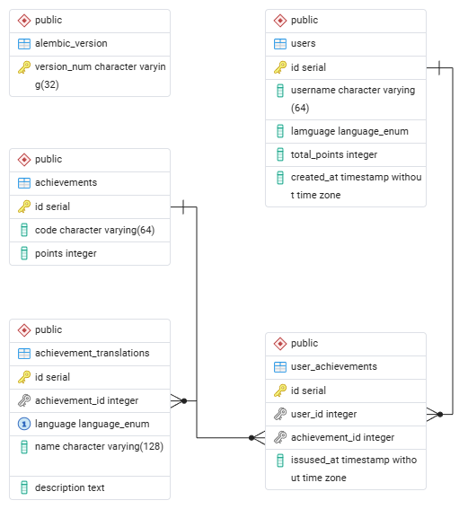
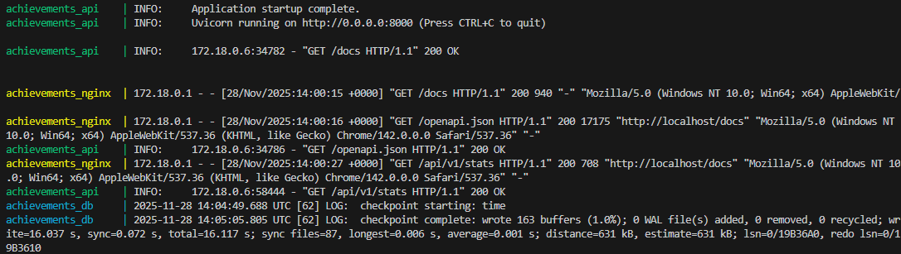
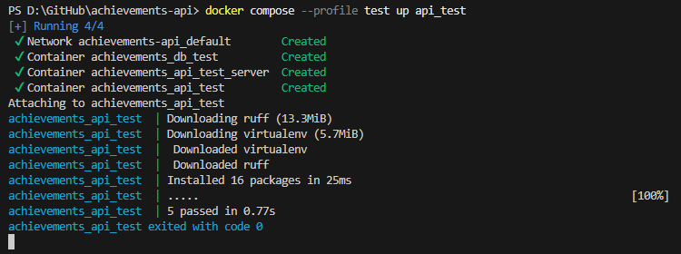

# Achievements API

Сервис для управления пользователями и их достижениями.

> **ВНИМАНИЕ про `.env`**  
> В этом репозитории файл `.env` добавлен **исключительно для удобства проверки тестового задания**.  
> В реальном проекте такие файлы с чувствительными данными в репозиторий **не коммитят** — используют `.env.example`, секреты в CI/CD, Vault и т.п.

## Технологический стек
- Python 3.12
- FastAPI + async SQLAlchemy 2.0
- PostgreSQL
- Alembic (code-first миграции)
- uv для управления зависимостями и виртуальным окружением
- Docker + docker-compose
- nginx как reverse proxy перед API
- Ruff, pre-commit, pytest + httpx

## Архитектура

Сервис состоит из трёх компонентов:

- **PostgreSQL (db)** — хранилище данных с пользователями, их достижениями.
- **API (api)** — FastAPI-приложение c асинхронным доступом к БД.
- **nginx (nginx)** — reverse proxy, который принимает HTTP-запросы на порт `80` и проксирует их в контейнер `api:8000`.

[](docs/db_schema.png)

Схема:

```text
Client (browser, curl)
        ↓
    nginx:80
        ↓
   api:8000 (FastAPI + uvicorn)
        ↓
     db:5432 (PostgreSQL)
```

Отдельно в Docker Compose есть тестовый стек:
- db_test — отдельная тестовая БД;
- api_test_server — API, поднятый поверх тестовой БД;
- api_test — контейнер, который запускает pytest.

## Основной функционал

Сервер хранит:
 1. Пользователей: 
    - имя пользователя
    - выбранный язык интерфейса ( ru / en );
 
 2. Достижения: 
    - код достижения;
    - имя и описание на двух языках ( ru / en );
    - количество очков за достижение (целое положительное число);

API предоставляет:
- получение информации о пользователе;
- получение списка всех достижений;
- добавление достижений;
- выдачу достижения пользователю (с сохранением времени выдачи);
- получение списка выданных достижений пользователя на выбранном им языке;
- статистику:
   - пользователь с максимальным количеством достижений;
   - пользователь с максимальной суммой очков;
   - пара пользователей с максимальной разностью очков;
   - пара пользователей с минимальной разностью очков;
   - пользователи, которые получали достижения 7 дней подряд.

## Переменные окружения

### Основной .env
```dotenv
POSTGRES_DB=achievements
POSTGRES_USER=app_user
POSTGRES_PASSWORD=app_password

APP_DEBUG=false
```

### Тестовый .env.test
```dotenv
POSTGRES_DB=achievements_test
POSTGRES_USER=app_user
POSTGRES_PASSWORD=app_password

APP_DEBUG=false
DATABASE_URL=postgresql+asyncpg://app_user:app_password@db_test:5432/achievements_test
```

## Запуск через Docker Compose
1. Клонировать репозиторий.
2. Создать .env в корне (можно взять за основу .env.example. Для удобства демонстрации .env уже лежит в репозитории, этот этап можно пропустить)
3. Запуск сервиса
```bash
docker compose --profile dev build
docker compose --profile dev up
```
5. Проверка:
API через nginx: http://localhost/
Swagger: http://localhost/docs
Пример: GET http://localhost/api/v1/users/1

При старте контейнера api автоматически:
- применяются миграции Alembic (alembic upgrade head);
- запускается скрипт seed_demo_data.py, который создаёт:
   - набор ачивок из app/data/achievements.json;
   - демонстрационных пользователей;
   - выдачи достижений, в том числе пользователей с 7-дневными стриками.

## Запуск тестов
1. Создать .env.test для запуска тестов (уже лежит в репозитории, можно пропустить)
2. Запустить тесты:
```bash
docker compose --profile test build
docker compose --profile test up api_test
```
Будут автоматически подняты:
- db_test (PostgreSQL)
- api_test_server (FastAPI)
- api_test (pytest)

## Качество кода
В проекте настроены:
- Ruff (линтер + форматер)
- pre-commit хуки
- логирование через app/core/logging.py

Запуск вручную:
```bash
uv run ruff check .
uv run ruff format .
uv run pre-commit run --all-files
```

## Структура проекта
app/
  api/
    v1/             # роутеры FastAPI
  core/
    config.py       # настройки (pydantic-settings)
    db.py           # async-engine и Session
    logging.py      # настройка логирования
  models/           # ORM-модели SQLAlchemy
  schemas/          # Pydantic-схемы
  services/         # бизнес-логика (users, achievements, stats)
  seed_demo_data.py # скрипт для генерации демо-данных
  data/
    achievements.json   # исходный набор достижений для сидинга
etc/
  migrations/       # Alembic миграции
nginx/
  nginx.conf        # конфигурация reverse proxy
docker-compose.yml
Dockerfile
README.md

### Скриншоты работы сервиса



